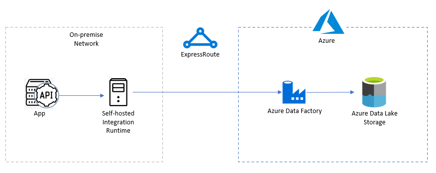

# Data Ingestion by Using Azure Data Factory
To copy data from on-premise environment, we need to have a self-hosted integration runtime (IR). Refer to the [video](https://www.youtube.com/watch?v=weiHOeje-QA) for more detailed introduction.
<div style="align: center">

</div>

<p style="text-align: center;">Figure 1. Self-hosted IR</p>

## Copy Data From SQL Server to Azure Blob Storage
* Need to have a separate server for the self-hosted IR.
* [Copy data to and from SQL Server by using Azure Data Factory](https://docs.microsoft.com/en-us/azure/data-factory/connector-sql-server)
* [Copy data from and to ODBC data stores using Azure Data Factory](https://docs.microsoft.com/en-us/azure/data-factory/connector-odbc)
## Copy Data From PostgreSQL Server to Azure Blob Storage
* To simulate a on-premise PostgreSQL server, you may [install a server on Azure VM](https://docs.microsoft.com/en-us/azure/virtual-machines/linux/postgresql-install). 
* Test the self-hosted IR's network connection with PostgreSQL server. Use the PowerShell command:
```
   Test-NetConnection <postgresql_server_ip> -port <port>
```
* If the TCP connection or Ping fail, run the following command in the PostgreSQL server.
```
   iptables -I INPUT 1 -m tcp -p tcp --dport 5432 -j ACCEPT
```
* Install ODBC Driver for PostgreSQL in self-hosted IR
* Configure ODBC for PostgreSQL
* Follow the steps [here](https://docs.microsoft.com/en-us/azure/data-factory/connector-postgresql).
## Copy Data From Local File System to Azure Blob Storage
* data file -> Azure Blob Storage -> ADF -> Azure Blob Storage/ADLS
https://www.sqlservercentral.com/articles/azure-data-factory-your-first-data-pipeline
* data file -> shared files on self-hosted IR -> ADF -> Azure Blob Storage/ADLS
* data file -> remote shared folder -> ADF -> Azure Blob Storage/ADLS
https://docs.microsoft.com/en-us/azure/data-factory/connector-file-system
## Copy Data From REST API to Azure Blob Storage
### Use Self-hosted IR to Call REST API
<div style="align: center">

</div>

<p style="text-align: center;">Figure 2. Call Rest API Directly</p>

If the REST API's been deployed in on-premise network environment, you need to follow the steps below:
* Set up the SHIR in on-premise environment
* In ADF, create REST API linked service by using the SHIR and the Base URL
* Create the REST dataset based on the REST API linked service
* Create Copy Data activity, using the REST dataset as the source, using the JSON dataset based on Azure Data Lake Storage linked service
### Use Self-hosted IR to Call REST API Managed by Self-hosted APIM Gateway
<div style="align: center">

</div>

<p style="text-align: center;">Figure 3. Call Rest API Through Self-hosted APIM Gateway</p>

* The only difference of this scenario vs the previous one, is that you need to install a [self-hosted APIM gateway](https://docs.microsoft.com/en-us/azure/api-management/self-hosted-gateway-overview) on an on-premise server.
* Then the Base URL in REST API linked service should be the URL filled in the APIM gateway.
* Self-hosted APIM gateway is managed by Azure API Management service provisioned on Azure

## Use Azure Function to Call REST API and Save Data to Azure Blob Storage
<div style="align: center">

</div>

<p style="text-align: center;">Figure 4. Call Rest API Through Azure Function</p>

* Create Azure Function App by using App Service Plan (Consumption plan doesn't support Vnet Integration) 
* Create Functions. Refer to the sample [FunctionCallRestAPI](https://github.com/gary918/AzureDataFactory/tree/main/FunctionCallRestAPI)
  * A Http triggered function
  * Access Rest API to get the data
  * Save the data into Azure Data Lake Storage, using [Azure Blob storage output binding for Azure Functions](https://docs.microsoft.com/en-us/azure/azure-functions/functions-bindings-storage-blob-output?tabs=java#http-trigger-using-outputbinding-java)
* Set Vnet Integration for the Azure Function, refer to [Integrate your app with an Azure virtual network](https://docs.microsoft.com/en-us/azure/app-service/web-sites-integrate-with-vnet)
  * Connect through Vpn (regional VNet Integration or gateway-required VNet Integration?)
  * Connect through ExpressRoute (regional VNet Integration only)
* In the ADF, create Azure Function Linked Service
* Create the Azure Function activity