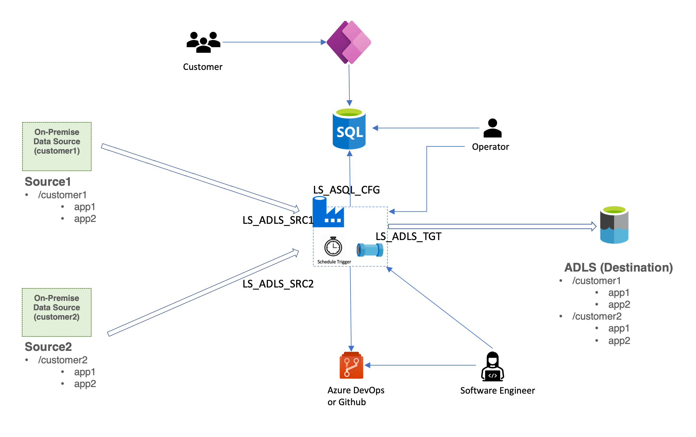

# Config Drive Data Pipeline Based on Azure Data Factory (ADF)
Data ingestion from customers' (on-premise) data source to cloud is a very common senario. Imagine if you need to ingest from different (kinds) of data sources from different customers, let's say 10 data source from 10 customers. Instead setting up different 10x10 data ingestion pipelines, we need to consider to leverage parameterized data pipelines by reading configuration parameters, which means, to have an configurable way to set up data pipelines efficiently.

This is the sample solution for setting up config driven data pipelines for data ingestion based on Azure Data Factory. 
## Architecture

In the diagram, we are going to ingest data from source1 and source2 into the destination which is Azure Data Lake Storage (ADLS). There are different personas who will use this solution:
* Software engineer: develop ADF pipeline templates
* Operator: 
  * Create self hosted integration runtime (SHIR) and linked services if needed through ADF studio
  * Maintain SQL database
* Customer: add/update ADF pipeline configuration in SQL database, through UI based on Power Apps

## Get Started
### Environment Preparation
* Fork the github repo
* Azure Data Factory
  * config the github repo
* Azure Storage Account
  * source1
    * Enable 'Enable hierarchical namespace' for Data Lake Storage Gen2
    * Create container 'customer1' with the sub folders: 'app1' and 'app2' and add the csv files into those folders
  * target
    * Enable 'Enable hierarchical namespace' for Data Lake Storage Gen2
    * Create container 'customer1' with the sub folders: 'app1' and 'app2' and add the csv files into those folders
* Azure SQL Database
  * Run the sql scripts to create the table and insert the data
* Optionally check if [Power Apps environment](https://make.preview.powerapps.com/) is ready to use

### Run the Demo
* Log into ADF studio and instatiate the pipeline by using PL_INGEST_TP template, by using the relevant linked services
* Log into Azure SQL Database and check the data
* Debug the instantiated ADF pipeline
* Check the results in the target Azure Storage Account folder
